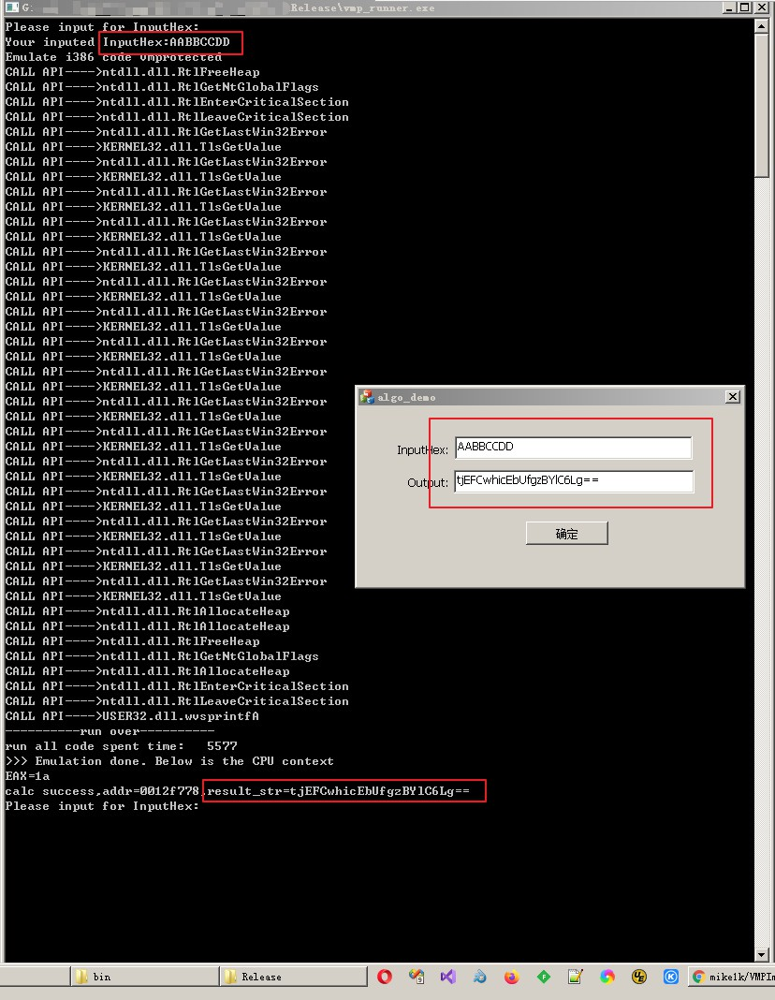
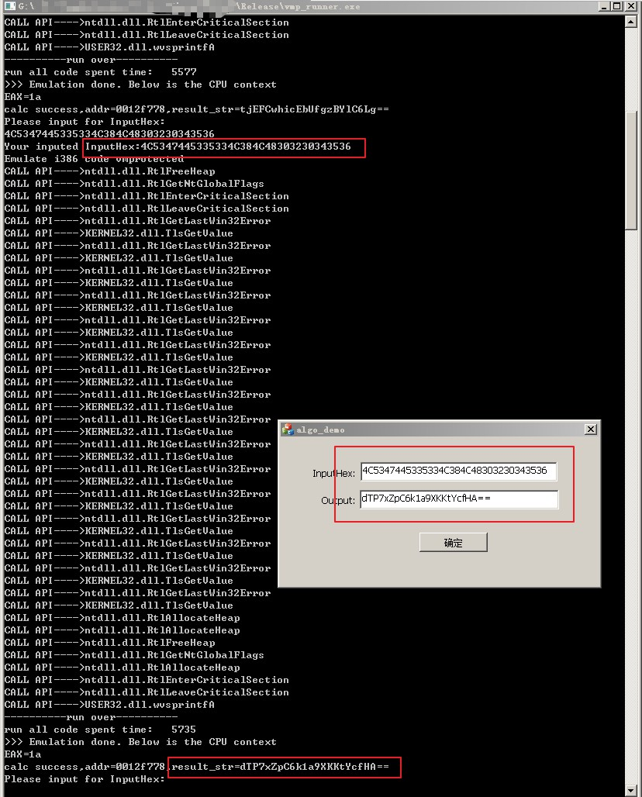

# vmp_runner
 A general solution to simulate execution of virtualized instructions (vmprotect/themida, etc.) based on Unicorn.

一个基于Unicorn模拟执行虚拟化指令（vmprotect/themida 等）的通用解决方案。

# Information

有些时候，我们拿到一个二进制文件，需要其中的某个算法，我们不关心算法实现，只关心输入和输出，但是二进制文件被加了某些强壳（vmp/tmd etc.）。

众所周知，vm代码还原是一个艰巨的工程，需要大量的时间和精力，由于我们只关心得到算法结果，所以如果有某种方式能跳过算法还原过程而直接模拟执行整个的虚拟代码将是一个很好的解决方案，QEMU 与基于其上的Unicorn使这个想法变的可行。

这里提供一个上面想法的成功演示：

“mfc_algo_demo” 是用于测试vmp_runner的工程，其内部包含一个算法（接收一个输入字符串，产生一个输出字符串）。

“mfc_algo_demo\bin “内有编译好的文件，包括vmp配置文件以及被加壳后的文件。

##### 在过去的2年中，我成功使用vmp_runner搞定过几个商业算法，为了让人知道我做了什么所以开了这个repo，所以如果你有这方面的需求或者对vmp_runner感兴趣且愿意付费，可以联系我。

### 最后附上针对mfc_algo_demo工程的vmp_runner效果图：

